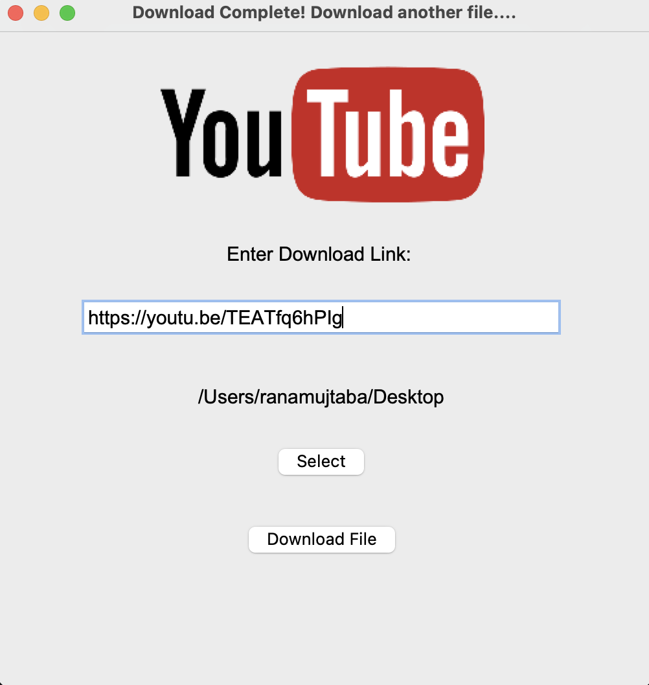

<h2> Youtube Downloader </h2>
<h3> Python </h3>
<h4> Pytube, Moviepy, Tkinter </h4>

This project is a simple and user-friendly GUI application for downloading YouTube videos. The user can enter the link to the video they want to download and choose a directory to save the file. The application leverages the power of the pytube and moviepy libraries to handle the download and manipulation of the video. The interface is designed with Tkinter, providing a clear and intuitive experience for the user. With its straightforward functionality, this project is ideal for anyone looking for an easy way to download YouTube videos. If you're interested in contributing to this project, feel free to reach out, any support would be appreciated!

To run the application on your device, download the files and enter the directory, download python if needed, then:
```
pip install pytube
pip install moviepy
python download.py
```

